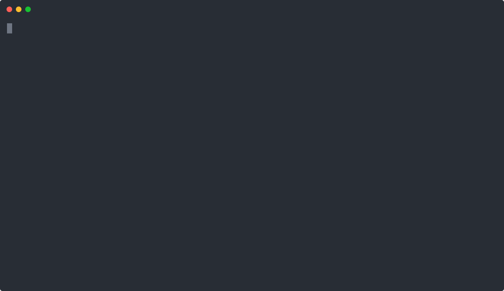
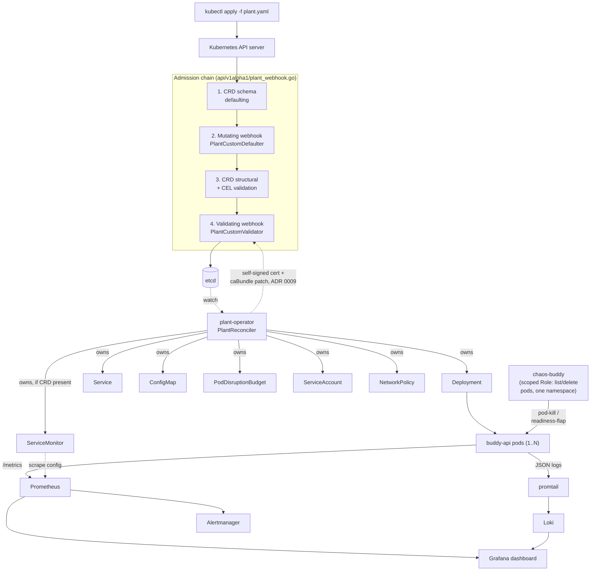
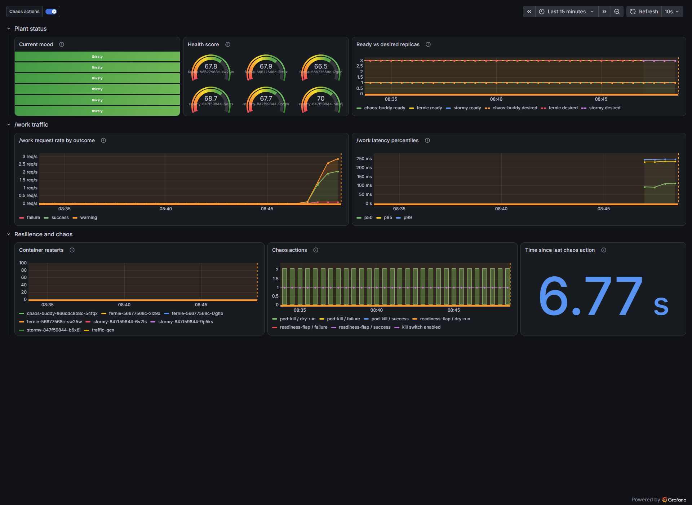
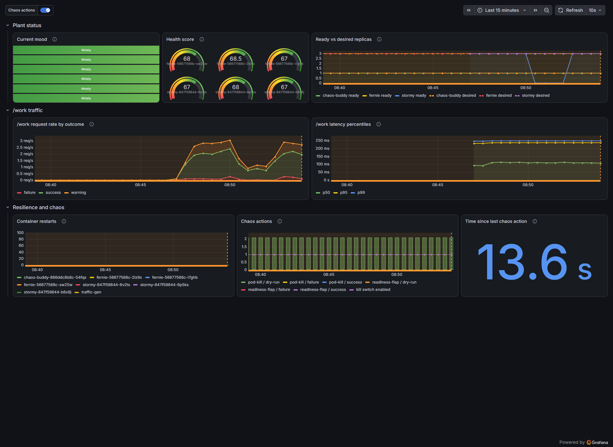

# K8s Buddy

A Kubernetes operator, in the shape of a talking plant, that proves it understands the control plane rather than just YAML.

[](https://github.com/kramersean/k8s-buddy/actions/workflows/ci.yaml)
[](LICENSE)

> The repository is not yet pushed to `github.com/kramersean/k8s-buddy`, so the badges above will 404 until it is — that's expected, not a defect in this README.

K8s Buddy turns a simulated "plant" workload into a Kubernetes `Custom Resource`: applying a `Plant` manifest causes a purpose-built operator to create and continuously reconcile a Deployment, Service, ConfigMap, PodDisruptionBudget, ServiceAccount, NetworkPolicy, and (when Prometheus is installed) a ServiceMonitor, then report the workload's aggregate mood and health back onto `Plant.status`. A narrowly-RBAC'd chaos injector wilts the plant on command, and Kubernetes — not this project's own code — brings it back, with Prometheus, Grafana, and Loki recording the whole arc. It demonstrates CRDs with OpenAPI/CEL validation, controller-runtime reconciliation with owner-reference garbage collection, admission webhooks, least-privilege RBAC, and multi-window SLO alerting as genuinely exercised properties of a running cluster, not claims in a slide deck.



`kubectl apply` a `Plant`, watch it reach `READY 3/3`, delete all of its pods, and watch it recover — real recovery time in this take is ~4 seconds (delete at 7.0s, back to `3/3` at 11.1s), timed from `docs/images/demo.cast`, the raw asciicast this SVG was rendered from, recorded live against the cluster this README was built against, not hand-authored.

## The hook

```console
$ kubectl -n k8s-buddy-plants get plants
NAME     SPECIES   MOOD    HEALTH   READY   DESIRED   AGE
fernie   fern      leafy   100      3       3         5h23m
```

That's real output from the live cluster this repository was built against — copied verbatim, not staged. `SPECIES`, `MOOD`, and `HEALTH` are printer columns on the `Plant` CRD (`api/v1alpha1/plant_types.go`); nothing about this row required `-o yaml` to be informative.

## Architecture



The operator, chaos injector, and observability stack are three independent Go binaries and two Helm-installed charts, all reconciling or observing the same `Plant`-shaped workload from different angles. See [Architecture](docs/architecture/README.md) for the reconcile loop's idempotence guarantees, the admission chain above walked through in prose, and how mood/health are derived.

## Quickstart

**~5–8 minutes** on a machine with nothing installed but Docker — most of that is `docker pull`ing kind's node image and building two Go binaries into container images; nothing here is interactive.

### Prerequisites (versions verified on the machine this was built on)

| Tool | Verified version | Required for |
|---|---|---|
| [Docker](https://docs.docker.com/get-docker/) | 29.6.1 | building images, running kind |
| [kind](https://kind.sigs.k8s.io/) | v0.32.0 | the local cluster |
| [kubectl](https://kubernetes.io/docs/tasks/tools/) | v1.36.1 | talking to it |
| [Go](https://go.dev/dl/) | go1.26.5 (module pins `go 1.26.0`) | building `cmd/*` |
| GNU Make | 3.81 | the single entry point, see `make help` |
| [Helm](https://helm.sh/docs/intro/install/) | v4.2.3 | the chart path and the observability stack |

Every command below is one that was actually run, on this machine, against this repository, immediately before this README was committed.

### 1. Clone and build the headline demo

```bash
git clone https://github.com/kramersean/k8s-buddy.git
cd k8s-buddy
make demo-operator
```

`make demo-operator` is the recommended path — [`make help`](#every-make-target) lists every target, but this is the one to reach for. It runs, unattended: `kind-up` (creates a 3-node cluster: 1 control-plane + 2 workers, so topology spread and PDB behavior are real rather than theoretical) → builds and loads both the `buddy-api` and `plant-operator` images → installs the `Plant` CRD → deploys the operator with its RBAC, webhooks, and self-signed certificate bootstrap → applies the `fernie` sample `Plant` → waits for `status.readyReplicas == spec.replicas` → prints `kubectl get plants` and the six unconditionally-owned children. Plan 1's older, operator-free static-manifest path still exists as `make demo` (see [What this demonstrates](#what-this-demonstrates) for why both are kept), and remains the fallback for a cluster where the operator itself is what's broken.

### 2. Watch it reconcile

```bash
kubectl -n k8s-buddy-plants get plants -w
kubectl -n k8s-buddy-plants get deploy,svc,cm,pdb,sa,netpol -l buddy.k8s-buddy.io/plant=fernie
```

### 3. Bring up observability and see the dashboard

```bash
make deploy-chaos            # chaos-buddy, shipped with --dry-run=true: it logs intended actions, deletes nothing
make observability-install   # kube-prometheus-stack + Loki + promtail, pinned chart versions, plus the committed dashboard
```

Grafana is reachable with no port-forward at **http://localhost:30300** (NodePort, wired in `deploy/kind/kind-config.yaml`). Get the generated admin password with `make grafana-port-forward` (username `admin`); the same target also opens a port-forward to `localhost:3000` if you'd rather not use the NodePort.

### 4. Watch Kubernetes heal a real failure

```bash
kubectl -n k8s-buddy-plants delete pod "$(kubectl -n k8s-buddy-plants get pods -l buddy.k8s-buddy.io/plant=fernie -o jsonpath='{.items[0].metadata.name}')"
kubectl -n k8s-buddy-plants get pods -l buddy.k8s-buddy.io/plant=fernie -w
```

Or, for the scripted version that also measures availability across the outage: `bash hack/demo.sh` (this targets the Plan 1 static path in the `k8s-buddy` namespace — it's what `make demo` runs, and it's also CI's own e2e pass/fail signal, not a decorative script).

### Every `make` target

`make help` is the source of truth; run it. The targets above (`demo-operator`, `deploy-chaos`, `observability-install`, `grafana-port-forward`) are the ones this quickstart uses; there are also targets for `helm-lint`/`helm-test`/`helm-install-dry`, `kustomize-build-overlays` (the `dev`/`prod` Kustomize overlays), `test-envtest`, and cluster teardown (`kind-down`, `observability-uninstall`, `undeploy-*`).

## What this demonstrates

| Feature | Kubernetes concept | Where |
|---|---|---|
| `Plant` is a CRD with `+kubebuilder:default`, `Enum`, `Pattern`, and CEL (`XValidation`) markers | CRDs + OpenAPI/CEL validation, not just YAML | `api/v1alpha1/plant_types.go` |
| `PlantReconciler.Reconcile` is a fetch → build → diff → apply → status loop, idempotent by construction (field-by-field mutation, before/after `DeepEqual`, a `LastWatered`-excluding status comparison) | controller-runtime reconciliation | `internal/controller/plant_controller.go`, `status.go` |
| Every child carries `controllerutil.SetControllerReference`; deleting a `Plant` cascades all seven children via Kubernetes' own garbage collector | Owner references + garbage collection | `internal/controller/resources.go`; proven live in CI's e2e job, not just asserted in a unit test |
| **No finalizer on `Plant`, deliberately** — a finalizer that cleans nothing (nothing here is external state) is a pure availability liability: it makes `kubectl delete` hang whenever the operator is down | The correct, considered *absence* of a common pattern | [ADR 0007](docs/adr/0007-no-finalizer-on-plant.md) |
| A mutating (defaulting) and validating webhook, registered via `admission.Defaulter[T]`/`admission.Validator[T]`; validation rejects `replicas: 0` (`"plants need at least one leaf"`), a sub-floor `wateringInterval`, a disallowed image registry, and any change to `spec.species` | Admission webhooks: defaulting + validating + immutability enforcement that CRD markers alone can't express | `api/v1alpha1/plant_webhook.go`; exact ordering in [Architecture](docs/architecture/README.md#the-admission-chain-in-exact-order) |
| The operator mints its own CA and serving cert at every startup, merges (never overwrites) the CA into both webhook configurations' `caBundle` | Self-signed certificate bootstrap, no cert-manager dependency | `cmd/plant-operator/webhookcerts.go`; [ADR 0009](docs/adr/0009-webhook-certificate-strategy.md) |
| Every namespace that runs a workload carries `pod-security.kubernetes.io/enforce: restricted`; every container is non-root, read-only-rootfs, all capabilities dropped | PodSecurity `restricted`, enforced (not just labeled) — proven by CI reading the namespace label back after pods actually landed | `deploy/kustomize/plants/namespace.yaml`; `internal/controller/resources.go`'s `SecurityContext` |
| A per-`Plant` `NetworkPolicy`, default-deny with exactly two holes (DNS egress, app ingress) | NetworkPolicy default-deny | `NetworkPolicyFor` in `resources.go`; [ADR 0003](docs/adr/0003-networkpolicy-ingress-open-on-tcp-8080.md) for why the ingress hole has no `from:` selector |
| `minAvailable = replicas - 1`, floored at 1, per `Plant` | PodDisruptionBudget | `PodDisruptionBudgetFor` in `resources.go` |
| `topologySpreadConstraints` across `kubernetes.io/hostname`, on a real 3-node kind cluster | Topology spread, exercised not just configured | `DeploymentFor` in `resources.go`; `deploy/kind/kind-config.yaml` |
| Multi-window, multi-burn-rate alerting on a stated 99%/30-day availability SLO (14.4x over 1h+5m to page, 6x over 6h+30m to ticket) | SLO burn-rate alerting, not a naive threshold | `observability/rules/slo.yaml`; [runbook](docs/runbook/README.md#the-slo) |
| The operator's `ClusterRole` grants exactly what it needs (no `secrets` cluster-wide, no `nodes`, and its one cluster-scoped write — patching the webhook `caBundle`s — is `resourceNames`-pinned to those two specific objects); chaos-buddy's `Role` grants only `list`/`delete` on `pods`, in one namespace | Least-privilege RBAC, asserted live in CI (`kubectl auth can-i`), not just written down | `config/rbac/role.yaml`; `deploy/kustomize/chaos/rbac.yaml` |
| The controller suite boots a real `kube-apiserver` + `etcd` (`envtest.Environment`, with `WebhookInstallOptions`) and asserts create/update/drift-correction/status transitions and both webhooks against it | envtest — the single highest-signal test artifact in the repo | `internal/controller/suite_test.go`, `plant_controller_test.go` |
| `--platform=$BUILDPLATFORM` cross-compiled, distroless, non-root, multi-arch (`linux/amd64`+`linux/arm64`) images with no `RUN` in the final stage | Distroless multi-arch images | `build/Dockerfile.{buddy-api,plant-operator,chaos-buddy}`; [ADR 0005](docs/adr/0005-distroless-nonroot-base-image.md) |

## Grafana screenshots

The dashboard (`observability/dashboards/k8s-buddy.json`) is provisioned automatically via the kube-prometheus-stack sidecar (a ConfigMap carrying the `grafana_dashboard: "1"` label) — never clicked together by hand.

**Healthy steady state** — three replicas of `fernie` and `stormy`, `/work` traffic flowing, health scores in the high 60s (`BUDDY_WORK_ERROR_RATE` at its default 5% keeps the mood at a realistic `thirsty` rather than a suspiciously perfect `leafy`):



**A real chaos run** — all three replicas of a `Plant` (`stormy`, the sample with `spec.chaos.enableEndpoints: true`) held not-ready via `POST /chaos/readiness` for ~2 minutes, then released. The "Ready vs desired replicas" panel shows the dip to zero and the recovery back to three, both inside the same 15-minute window — a reviewer can point at the exact moment chaos hit and the exact moment recovery completed:



Reproduce it yourself: apply `config/samples/plant-chaos.yaml`, `kubectl port-forward` to each of its three pods, `POST {"ready":false}` then (after holding long enough for Prometheus's 30s scrape interval to sample it — a single pod-kill recovers faster than kube-state-metrics reliably samples, which is why this uses a held readiness flap rather than `chaos-buddy`'s default `pod-kill` mode) `POST {"ready":true}` to `/chaos/readiness` on each. `chaos-buddy` itself was never taken out of `--dry-run=true` to produce either screenshot.

## Architecture Decision Records

Nine, numbered, immutable once accepted — a decision that's later reversed gets a new ADR, not an edit. Full index: [`docs/adr/`](docs/adr/).

| ADR | Decision |
|---|---|
| [0001](docs/adr/0001-record-architecture-decisions.md) | Record every architecturally significant decision as an ADR, so "why" survives past the branch that made it. |
| [0002](docs/adr/0002-in-process-shutdown-delay-instead-of-prestop-hook.md) | Graceful shutdown runs in-process (`SetReady(false)` → sleep → drain), not a `lifecycle.preStop` hook — the distroless image has no shell to exec into. |
| [0003](docs/adr/0003-networkpolicy-ingress-open-on-tcp-8080.md) | The app-ingress `NetworkPolicy` hole has no `from:` selector, because NodePort traffic arrives SNAT'd to a node IP that a `podSelector` rule would silently black-hole. |
| [0004](docs/adr/0004-liveness-never-consults-readiness-or-business-health.md) | `/healthz` never consults readiness or the mood engine — a degraded-but-alive pod must stay running and observable, not get restarted into losing its own signal. |
| [0005](docs/adr/0005-distroless-nonroot-base-image.md) | `gcr.io/distroless/static-debian12:nonroot`: no shell, no package manager, satisfies PSA `restricted` as shipped. |
| [0006](docs/adr/0006-operator-reproduces-base-manifests.md) | The operator's Go builders and the static Kustomize manifests describe the same workload twice, deliberately, with a test that fails if they ever disagree on what they're supposed to agree on. |
| [0007](docs/adr/0007-no-finalizer-on-plant.md) | No finalizer on `Plant` — an inert one is a pure availability cost, not a demonstration of the pattern. |
| [0008](docs/adr/0008-deferred-to-plan-3.md) | HPA is permanently out of scope (kind ships no metrics-server); the ServiceMonitor deferral is closed as the operator's seventh owned child; `PlantSpec.chaos` was dropped in Plan 2, then restored — narrower and opt-in — once `chaos-buddy`'s readiness-flap mode needed a real endpoint to target. |
| [0009](docs/adr/0009-webhook-certificate-strategy.md) | Webhook certificates are self-signed and regenerated by the operator itself at every startup, merged (never overwritten) into both `caBundle`s — no cert-manager, no manual `openssl` step. |

## What this is not

Stating limits reads as confidence, not weakness:

- **Local-only.** The entire demo runs on a local `kind` cluster. There is no deployment to real cloud infrastructure, no managed Kubernetes service, and `make demo-operator` on a machine with Docker is the whole install story.
- **No persistence.** The plant is stateless by design; nothing here uses a `PersistentVolume`, and restarting a pod loses its in-memory `/work` observation window on purpose.
- **No authentication on buddy-api.** `/work`, `/status`, and the chaos endpoints are open on the cluster network. This is a demo workload, not a service handling anything sensitive.
- **No service mesh.** It would add operational surface without adding signal to what this project is trying to show.
- **No multi-cluster or federation.**
- **No HorizontalPodAutoscaler, permanently** — not merely deferred. kind ships no `metrics-server`, so an HPA here would sit `ScalingActive=False` forever, which is worse than absent: it looks correct in `kubectl get hpa` and does nothing. See [ADR 0008](docs/adr/0008-deferred-to-plan-3.md#1-horizontalpodautoscaler--permanent-not-merely-deferred). `kubectl scale plant <name> --replicas=N` works today via the CRD's scale subresource — only autoscaling is out.
- **Three chaos modes were dropped, not stubbed.** The original design named five: `pod-kill`, `readiness-flap`, `latency`, `cpu-burn`, `oom`. Only the first two are implemented against real behavior in buddy-api. `latency`, `cpu-burn`, and `oom` do not exist as flags at all — `chaos-buddy`'s `ParseMode` rejects them by name at startup rather than accepting a mode that silently does nothing. A knob that appears in a flag list and has no effect is worse than an absent knob.

## Known interactions worth documenting

Three things a careful reviewer will notice and might otherwise read as bugs:

1. **Two concurrently-running operator releases both hold cluster-wide RBAC over every `Plant` on the cluster.** `plant-operator`'s `ClusterRole` (`config/rbac/role.yaml`) is cluster-scoped by necessity — a `Plant` can live in any namespace — and the binary has no `--namespace` flag to narrow its own watch to one. Installing the chart alongside the kustomize path (or twice, under two release names) means both operators reconcile the *same* `Plant` objects; nothing partitions ownership between them beyond each one's own idempotent convergence toward the same desired state, which happens to make running two harmless rather than actively conflicting (both compute the same desired object from the same `Plant`, so neither ever undoes the other's write) — but this is not the same thing as isolation, and should not be read as one.
2. **Helm 4's bare `--dry-run` contacts a live API server.** Unlike Helm 3, a plain `helm install --dry-run` under Helm 4 still reaches out to the cluster for schema validation and server-side rendering. `--dry-run=client` renders and validates entirely locally, which is why it — not the bare flag — is what `make helm-install-dry` uses, and it's the only form that works identically in CI's cluster-less `manifests` job, against this live cluster, and on a machine with no cluster at all.
3. **A fresh `deploy-operator`/`demo-operator` run, or a real `helm install --set plant.enabled=true`, can race the operator's own webhook Service the very first time anything is admitted through it.** `kubectl rollout status`/`--wait` only prove the operator's Pod itself reports Ready (the `/readyz` probe answered by the manager's health server, which starts before — and is not gated on — the webhook TLS listener's Service actually being routable); on kind, kube-proxy's ClusterIP→pod-IP programming lands a beat after the Endpoints object does. Applying (or admitting) anything through the validating webhook in that window fails with `dial tcp <clusterIP>:443: connect: connection refused` — observed reproducibly on a clean-room rebuild, not a one-off. `demo-operator` retries the sample `Plant` apply itself (`kubectl apply` is idempotent, so this is safe) and needs no workaround from a caller. A real `helm install --set plant.enabled=true` has no such retry inside a single atomic install — Helm applies the operator Deployment and the optional sample `Plant` in the same pass — so it can fail on first try; `helm upgrade --install` with the same arguments immediately after succeeds, because the operator Deployment from the failed attempt is left running (Helm does not roll back a plain, non-`--atomic` failed install) and has had a few more seconds to become routable by the retry.

## Repository layout

Kubebuilder conventions throughout, so the layout is familiar to anyone who has read a controller-runtime operator before:

```
cmd/{buddy-api,plant-operator,chaos-buddy}/main.go   entry points
api/v1alpha1/                                        Plant CRD types, deepcopy, webhooks
internal/api/           buddy-api's HTTP handlers
internal/mood/          pure mood/health scoring (no Kubernetes, no HTTP)
internal/chaos/         chaos-buddy's decision logic (pure) and Kubernetes calls
internal/controller/    the Plant reconciler, resource builders, envtest suite
internal/telemetry/     shared structured-logging and Prometheus metrics setup
config/{crd,rbac,webhook,samples}/    kubebuilder-generated manifests + sample Plants
charts/k8s-buddy/       the Helm packaging
deploy/kind/            kind cluster config
deploy/kustomize/{base,operator,chaos,plants,overlays}/
deploy/observability/   Helm values + RBAC + ServiceMonitors for the stack
observability/{dashboards,rules}/    the dashboard JSON and PrometheusRules, committed as code
docs/{adr,architecture,runbook,images}/
.github/workflows/       CI: lint, test, build, scan, manifests, e2e
```

## Contributing

See [CONTRIBUTING.md](CONTRIBUTING.md). Licensed under the [MIT License](LICENSE).
